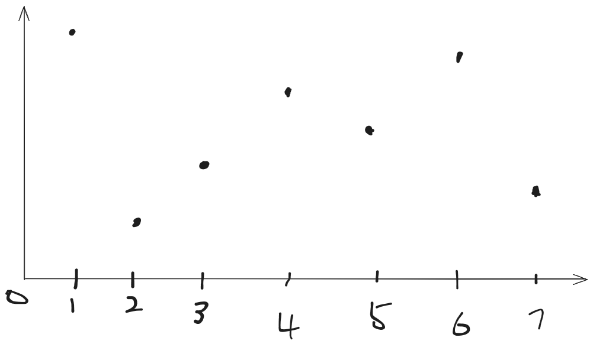
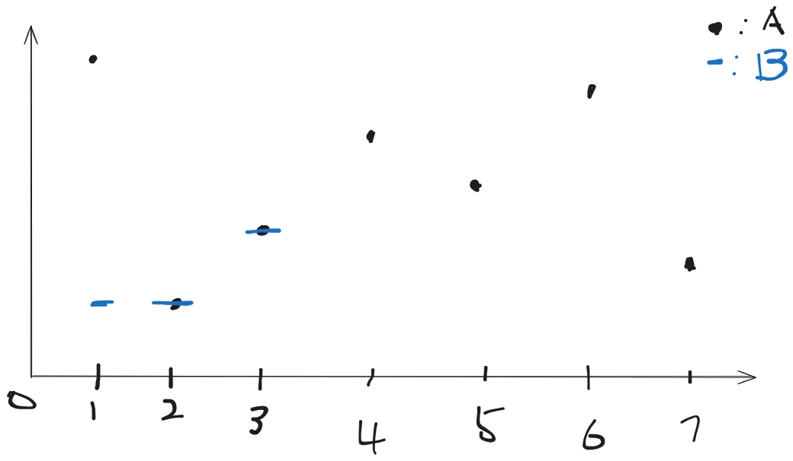
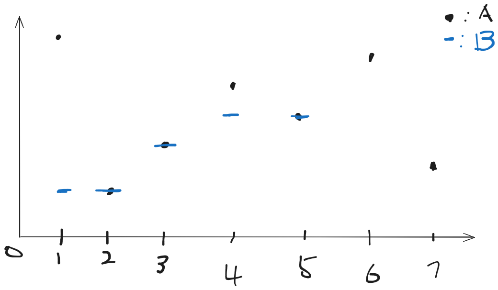

{/* truncate */}
## 题解
### 题意
**形式化题意**

给定长度为 **N** 的整数序列 **A₁, A₂, …, A_N**。

需要构造一个长度为 **N** 的整数序列 **B₁, B₂, …, B_N**，使得该序列满足以下两个条件之一：

- **B₁ ≤ B₂ ≤ … ≤ B_N**（单调不降），或
- **B₁ ≥ B₂ ≥ … ≥ B_N**（单调不升）

目标是最小化总花费：

**Σᵢ₌₁ᴺ |Aᵢ - Bᵢ|**

输出最小的总花费。

**数据范围**

- **1 ≤ N ≤ 2000**
- **0 ≤ Aᵢ ≤ 10⁹**
- 保证答案在 32 位整型范围内

### 解法
这是一道很典型的线性$dp$问题

首先很容易发现单调不降和单调不增可以分开处理。一下以单调不降为例。

首先，我们发现这个题目中很麻烦的是这个绝对值。所以我们很容易想到去转化这个绝对值。可是绝对值转化太多了，我们要用哪个呢？
（以后可能会单独出一个转化绝对值的总结，但是蒟蒻刷题量不够以后再说吧）

这道题运用的也是一个经典转化，我们把两个数放在数轴上，那么绝对值就是这两个数的距离。

这样我们就转化成对于一个数轴上的$n$个数，我们要找一个单调不减的序列使得序列中每个数对应的$A$在数轴的数之间的距离最小。

然后我们画个图

其中横轴表示序号，纵轴表示这个数的值

然后我们考虑选$B$（图中用蓝色点表示）。

那么我们假设已经选到了$B_i$，且前$i-1$个数都已经选好了。（图中假设选到第$4$个，已经选好了前$3$个）。

那么对于选$B_i$，存在两种情况
- $1.$若$A_i \geq B_{i-1}$,那么我们选择$B_i=A_i$显然最优（如图中$4$的情况）。

- $2.$若$A_i < B_{i-1}$,首先一个想法是令$B_i=B_{i-1}$因为这样最大限度保持前$i-1$个还是最优，但是这样总的来说是最优的吗？显然不是（随手搓几组样例就能$hack$掉）。那么这样的花我们只能让$B_{i-1}$降低，那么$B_i$也就跟着降低并保持与$B_{i-1}$相同。而这样当$B_{i-1}$降低到$<B_{i-2}$时就只能接着同时降低$B_{i-2}$使得$B_i=B_{i-1}=B_{i-2}$那么，以此类推，那么存在一个区间$[j,i]$使得这个区间的$B$值相等。此时这个区间的$B$值大小要么等于$B_{j-1}$要么就等于$[A_j,A_i]$的中位数。因为这样才能使这个权值的贡献最小。（原因是很显然的）（如图中5的情况）


那么我们就可以得到一个结论，$B$数组中的每个数都在$A$中出现过。

我们可以设计状态，由于我们需要保证序列的单调不降，可以考虑将当前最后一个数的大小放入状态。

$f_{i,j}$表示前$i$个数，最后一位是$j$的最小权值。

根据那个结论，我们把$A$数组离散化，那么$j$也一定是$A$数组中的数，那么空间就可以降为$O(n^2)$

考虑转移，其实很显然。
$$
f_{i,j}=\min_{0\leq k \leq j}(f_{i-1,k}+\left|   A_{i}-j\right|)
$$

那么这道题就做完了，时间复杂度$O(n^2)$

### 代码
<details>
<summary>code</summary>
```cpp
#include<bits/stdc++.h>
using namespace std;
const int N=2e3+10;
const int inf=INT_MAX;
int n;
int a[N];
int b[N];
int f[N][N];
int g[N][N];
int main()
{
    // freopen("3.in","r",stdin);
    // freopen("3.out","w",stdout);
    ios::sync_with_stdio(false);
    cin.tie(nullptr);
    cin>>n;
    for(int i=1;i<=n;i++) cin>>a[i],b[i]=a[i];
    sort(b+1,b+n+1);
    int m=unique(b+1,b+n+1)-b-1;
    for(int i=1;i<=n;i++)
    {
        a[i]=lower_bound(b+1,b+m+1,a[i])-b;
    }
    for(int i=1;i<=n;i++)
    {
        int minn=inf;
        for(int j=0;j<=m;j++)
        {
            minn=min(minn,f[i-1][j]+abs(b[a[i]]-b[j]));
            f[i][j]=minn;
        }
    }
    int ans=inf;
    for(int j=0;j<=m;j++) ans=min(ans,f[n][j]);
    for(int i=1;i<=n;i++)
    {
        int minn=inf;
        for(int j=m;j>=0;j--)
        {
            minn=min(minn,g[i-1][j]+abs(b[a[i]]-b[j]));
            g[i][j]=minn;
        }
    }
    for(int j=0;j<=m;j++) ans=min(ans,g[n][j]);
    cout<<ans;
    return 0;
}
```
</details>
### 小结
这是一道很经典的贪心动态规划题目，遇到这种题目可以考虑画图去思考。